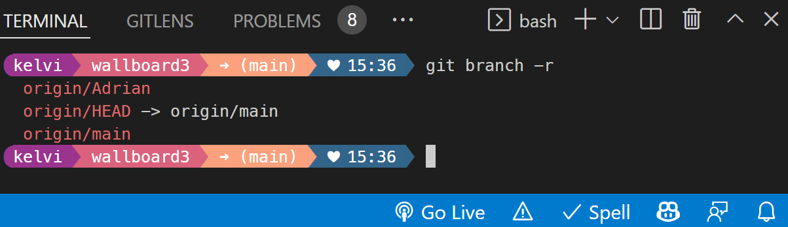

**0. What is this?**

This is the instruction to make your Windows Terminal look cool.  

There are lots of articles on this topic already. However, I couldn't find anything that covers how to set up: 

1. `Windows PowerShell`
2. `Git Bash`
3. `CMD Command Line`
4. `WSL Ubuntu` 
5. `VS Code Terminal`
   
All in one place. So, I have decided to put all my findings together and make it convenient those who need it. 

Screenshot to show that it works with `PowerShell`, `git bash`, `cmd`, `WSL`:

Screenshot to show that it works on `VS Code` as well:


So are you ready?

--------------------------------------------
**1. Windows Terminal**

Download and install Windows Terminal if you don't have it.

Create a Terminal shortcut with escalated Administrator rights.

Firstly, on your desktop, right click to bring up the menu and choose `create shortcut`

Properties->Shortcut tab->Target as:

`%LocalAppData%\Microsoft\WindowsApps\wt.exe`

Properties->Shortcut tab->Start in:

`%userprofile%\AppData\Local\Microsoft\WindowsApps`

Properties->Shortcut tab->Change Icon:

find .ico in `\images` assets and copy it to your folder below:

`%userprofile%\AppData\Local\Packages\Microsoft.WindowsTerminal_8wekyb3d8bbwe\LocalState\terminal.ico`
(WindowsTerminal_{appid} may vary according to your computer)

Properties->Shortcut tab->Advanced:

check `'Run as Administrator'`

Right-click the shortcut on your desktop and choose `'Pin it to taskbar'`

Now, run the Windows Terminal shortcut and see it work.

Open Windows Terminal settings by clicking the gear button from the drop-down menu, then click the left bottom gear button to open your `settings.json` file.

Copy & paste this code into it:

(Replace my `defaultProfile` and `guid`s with yours in your settings file)

```json
    {
        "$help": "https://aka.ms/terminal-documentation",
        "$schema": "https://aka.ms/terminal-profiles-schema",
        "actions": 
        [
            {
                "command": 
                {
                    "action": "copy",
                    "singleLine": false
                },
                "keys": "ctrl+c"
            },
            {
                "command": "paste",
                "keys": "ctrl+v"
            },
            {
                "command": "find",
                "keys": "ctrl+shift+f"
            },
            {
                "command": 
                {
                    "action": "splitPane",
                    "split": "auto",
                    "splitMode": "duplicate"
                },
                "keys": "alt+shift+d"
            }
        ],
        "copyFormatting": "none",
        "copyOnSelect": true,
        "defaultProfile": "{0caa0dad-35be-5f56-a8ff-afceeeaa6101}",
        "focusFollowMouse": true,
        "initialRows": 30,
        "profiles": 
        {
            "defaults": 
            {
                "background": "#15212c",
                "backgroundImage": "ms-appdata:///local/lime-os-M.png",
                "backgroundImageAlignment": "topRight",
                "backgroundImageStretchMode": "none",
                "colorScheme": "Lime",
                "cursorColor": "#FFFFFF",
                "cursorShape": "bar",
                "font": 
                {
                    "face": "3270Medium Nerd Font",
                    "size": 12
                },
                "hidden": false,
                "historySize": 9001,
                "opacity": 72,
                "padding": "0, 0, 0, 0",
                "snapOnInput": true,
                "startingDirectory": "%USERPROFILE%",
                "useAcrylic": false
            },
            "list": 
            [
                {
                    "closeOnExit": "graceful",
                    "commandline": "%SystemRoot%\\System32\\cmd.exe",
                    "guid": "{0caa0dad-35be-5f56-a8ff-afceeeaa6101}",
                    "name": "Command Prompt"
                },
                {
                    "closeOnExit": "graceful",
                    "guid": "{2ece5bfe-50ed-5f3a-ab87-5cd4baafed2b}",
                    "hidden": false,
                    "name": "Git Bash",
                    "source": "Git"
                },
                {
                    "closeOnExit": "graceful",
                    "guid": "{2c4de342-38b7-51cf-b940-2309a097f518}",
                    "hidden": false,
                    "name": "Ubuntu",
                    "source": "Windows.Terminal.Wsl"
                },
                {
                    "closeOnExit": "graceful",
                    "guid": "{574e775e-4f2a-5b96-ac1e-a2962a402336}",
                    "hidden": false,
                    "name": "PowerShell",
                    "source": "Windows.Terminal.PowershellCore"
                },
                {
                    "closeOnExit": "never",
                    "guid": "{b453ae62-4e3d-5e58-b989-0a998ec441b8}",
                    "hidden": false,
                    "name": "Azure Cloud Shell",
                    "source": "Windows.Terminal.Azure"
                },
                {
                    "guid": "{61c54bbd-c2c6-5271-96e7-009a87ff44bf}",
                    "hidden": true,
                    "name": "Windows PowerShell"
                }
            ]
        },
        "schemes": 
        [
            {
                "background": "#1A1A1A",
                "black": "#000000",
                "blue": "#579BD5",
                "brightBlack": "#797979",
                "brightBlue": "#9CDCFE",
                "brightCyan": "#2BC4E2",
                "brightGreen": "#1AD69C",
                "brightPurple": "#975EAB",
                "brightRed": "#f7cbd6",
                "brightWhite": "#EAEAEA",
                "brightYellow": "#e9e0b0",
                "cursorColor": "#FFFFFF",
                "cyan": "#00B6D6",
                "foreground": "#E8F4FF",
                "green": "#4EC9B0",
                "name": "Lime",
                "purple": "#b99dd1",
                "red": "#ee959d",
                "selectionBackground": "#FFFFFF",
                "white": "#EAEAEA",
                "yellow": "#eee094"
            }
        ],
        "trimBlockSelection": true,
        "useAcrylicInTabRow": false,
        "windowingBehavior": "useAnyExisting"
    }
 ```
--------------------------------------------
**2. Fonts**

I have chosen these 2 fonts to work with, let's install them:

https://www.nerdfonts.com/font-downloads

Download and install `3270 font` (for Windows Terminal)

Download and install `MesloLGM Nerd Font` (for Visual Studio Terminal)

--------------------------------------------
**3. Background image**

Put the png and ico files into the same folder as the `setttings.json` in:

`%userprofile%\AppData\Local\Packages\Microsoft.WindowsTerminal_{appid}\LocalState`

You can get my half transparent logo or use your own picture.
Note that you may want to adjust the picture positioning in:

`settings.json` -> `backgroundImageAlignment`.

--------------------------------------------
**4. oh-my-posh**

Take a loot at `oh-my-posh` from https://ohmyposh.dev/docs/installation/windows and see what it is. 

open PowerShell to install it by typing:

`winget install oh-my-posh`

Make sure your Windows environment variable is pointing to:

`Path -> %userprofile%\AppData\Local\Programs\oh-my-posh\bin`

Restart PowerShell and check that it is working by typing: 

`oh-my-posh` 

(You may need to restart the terminal, or restart the pc for it to take effect)

You can pick your own default theme from https://ohmyposh.dev/docs/themes

Or in this case I have created a custom theme file in `%userprofile%/.oh-my-posh-theme.omp.json`

```json
{
    "$schema": "https://raw.githubusercontent.com/JanDeDobbeleer/oh-my-posh/main/themes/schema.json",

    "blocks": [{
            "alignment": "left",
            "segments": [{
                    "type": "text",
                    "style": "diamond",
                    "leading_diamond": "\ue0b6",
                    "foreground": "#ffffff",
                    "background": "#cc3802",
                    "template": "{{ if .Env.PNPPSHOST }} \uf8c5 {{ .Env.PNPPSHOST }} {{ end }}"
                },
                {
                    "type": "text",
                    "style": "powerline",
                    "foreground": "#ffffff",
                    "background": "#047e84",
                    "powerline_symbol": "\ue0b0",
                    "template": "{{ if .Env.PNPPSSITE }} \uf672 {{ .Env.PNPPSSITE }}{{ end }}"
                },
                {
                    "type": "text",
                    "style": "diamond",
                    "trailing_diamond": "\ue0b4",
                    "foreground": "#ffffff",
                    "background": "#047e84",
                    "template": "{{ if .Env.PNPPSSITE }}\u00A0{{ end }}"
                }
            ],
            "type": "rprompt"
        },
        {
            "alignment": "left",
            "segments": [{
                    "background": "#9A348E",
                    "foreground": "#ffffff",
                    "leading_diamond": "\ue0b6",
                    "style": "diamond",
                    "template": "{{ .UserName }} ",
                    "type": "session"
                },
                {
                    "background": "#DA627D",
                    "foreground": "#ffffff",
                    "powerline_symbol": "\ue0b0",
                    "properties": {
                        "style": "folder"
                    },
                    "style": "powerline",
                    "template": " {{ .Path }} ",
                    "type": "path"
                },
                {
                    "background": "#FCA17D",
                    "foreground": "#ffffff",
                    "powerline_symbol": "\ue0b0",
                    "properties": {
                        "branch_icon": "",
                        "fetch_stash_count": true,
                        "fetch_status": false,
                        "fetch_upstream_icon": true
                    },
                    "style": "powerline",
                    "template": " \u279c ({{ .UpstreamIcon }}{{ .HEAD }}{{ if gt .StashCount 0 }} \uf692 {{ .StashCount }}{{ end }}) ",
                    "type": "git"
                },
                {
                    "background": "#86BBD8",
                    "foreground": "#ffffff",
                    "powerline_symbol": "\ue0b0",
                    "style": "powerline",
                    "template": " \ue718 {{ if .PackageManagerIcon }}{{ .PackageManagerIcon }} {{ end }}{{ .Full }} ",
                    "type": "node"
                },
                {
                    "background": "#33658A",
                    "foreground": "#ffffff",
                    "properties": {
                        "time_format": "15:04"
                    },
                    "style": "diamond",
                    "template": " \u2665 {{ .CurrentDate | date .Format }} ",
                    "trailing_diamond": "\ue0b0",
                    "type": "time"
                }
            ],
            "type": "prompt"
        }
    ],
    "final_space": true,
    "version": 2
}
```

Restart Windows Terminal to see it take effect.

---------------------------------------
**5. PowerShell**

Download the latest powerShell and install it from https://docs.microsoft.com/en-us/powershell/scripting/install/installing-powershell-on-windows

Install the following plugins:

#Terminal-Icons: displays colour folder & file icons. 

#PSReadLine: gives you intellisense when you type. They are available in PowerShell only, not cmd or git bash.

to install in powerShell type:

`Install-Module -Name Terminal-Icons`
Press A or Y

`Install-Module -Name PSReadLine` (use `-Force` if needed)
Press A or Y

Now in PowerShell test the profile .sp1 file location by typing:

`echo $PROFILE`  

Create the file if does not exist `/Documents/PowerShell/Microsoft.PowerShell_profile.ps1`  and write this into the file:

```pwsh
    oh-my-posh init pwsh --config .oh-my-posh-theme.omp.json | Invoke-Expression
    Import-Module -Name Terminal-Icons 
    Import-Module -Name PSReadLine 
    Set-PSReadLineOption -PredictionSource History
    Set-PSReadLineOption -PredictionViewStyle ListView
    Set-PSReadLineOption -EditMode Windows
```

----------------------------------------
**6. Configure Git Bash & VS Code**

First, you can update git in cmd:

`git update-git-for-windows`

turn on git bash and check:

`oh-my-posh` (to see it actually working)

`echo $HOME` (it should be the same as your cmd & powershell home directory) 

Go to the home directory `%userprofile%` then edit or create the `.bashrc` file:

```bash    
    eval "$(oh-my-posh --init --shell bash --config .oh-my-posh-theme.omp.json)"
```

Restart Windows Terminal to see it take effect.

Now, once the git bash works, your VS Code integrated terminal should also be working.
You can open VS code terminal to test it.

As mentioned above, a Nerd Font is needed for VS Code if you have not already done it. 

Go to VS Code, settings search for `terminal.integrated.fontFamily` and set the font and size there. I have chosen:

`MesloLGM Nerd Font` and `font size 10`.

(If you have newly installed the font make sure you restart VS to take effect)

----------------------------------------
**7. Configure cmd**

Get `Lua` from http://luabinaries.sourceforge.net/download.html

No need to install it, just extra all files to the following folder and add Windows system variables:

`path -> add c:/Program Files/lua`

(Make sure system variables works by typing lua54.exe in a terminal, you may need to restart the cmd, or restart the pc)

Also get `Clink` from https://github.com/chrisant996/clink/releases

Once you have installed it, you will go to the following folder:

`%userprofile%\AppData\Local\clink`

Create `cmd-oh-my-posh.lua` file in the folder:

```lua
    local custom_prompt = clink.promptfilter(50)
    function custom_prompt:filter(prompt)
        load(io.popen('oh-my-posh init cmd --config .oh-my-posh-theme.omp.json'):read("*a"))()
    end
```

Restart Windows Terminal to see it take effect.

-----------------------------------------
**8. For WSL**

If you have not Install WSL follow this instructionin https://docs.microsoft.com/en-us/windows/wsl/install

run this in PowerShell: 

`wsl --install`

(If it doesn't start check to make sure you don't have any other Windows update pending)

Restart the computer, and Ubuntu installation continues.

You can run an update for WSL:

`sudo apt update && sudo apt upgrade -y`

Then install homebrew with this instruction https://www.how2shout.com/linux/install-brew-on-wsl-windows-subsystem-for-linux/

The installation is going to take some time, wait patiently. When it is done we move on.

Install `oh-my-posh` with `HomeBrew`:

`brew install jandedobbeleer/oh-my-posh/oh-my-posh`

Once that is done, open a WSL terminal and find out where your WSL folder is by typing:

`cd $HOME`

`explorer.exe .` (don't miss the dot `.`)

Now you would get your WSL folder under something like `\\wsl$\Ubuntu\home\{yourname}`

Open the `.bashrc` file under the folder, append this to the end of the file:

```bash
    eval "$(oh-my-posh --init --shell bash --config .oh-my-posh-theme.omp.json)"
    clear
```

Open the `.profile` file under the folder, insert this to the beginning of the file:

(If you have `.bash_profile`, do the same as `.profile` file.)

```bash
    eval "$(/home/linuxbrew/.linuxbrew/bin/brew shellenv)"
```

Restart Windows Terminal to see it take effect.

-----------------------------------------
**9. Related Software & Versions**

| Software         | Version               |
|------------------|-----------------------|
| Windows Terminal | [ v1.12.10983.0 ]     |
| PowerShell       | [ v7.2.4 win x64 ]    |
| WSL Ubuntu       | [ v2 ]                |
| git              | [ v2.36.1.windows.1 ] |
| clink            | [ v1.3.17.0a95d0 ]    |
| lua              | [ v5.4.2 ]            |

-----------------------------------------